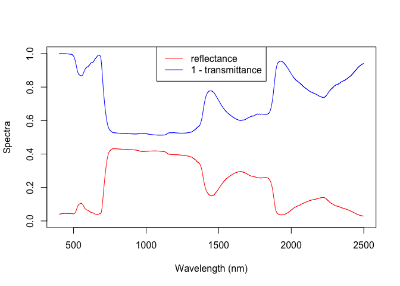

<!-- README.md is generated from README.Rmd. Please edit that file -->

# rrtm

<!-- badges: start -->

<!-- badges: end -->

The goal of `rrtm` is to provide efficient R implementations of
radiative transfer models useful for vegetation remote sensing.

## Installation

`rrtm` is not currently on CRAN, but you can install the development
version of `rrtm` from [GitHub](https://github.com/) with:

``` r
# install.packages("devtools")
devtools::install_github("ashiklom/rrtm")
```

## Example usage

This is a basic example of running the PROSPECT 5 leaf radiative
transfer model.

``` r
library(rrtm)
out <- prospect5(1.4, 40, 10, 0.01, 0.01)
head(out)
#>      reflectance transmittance
#> [1,]  0.04100974  0.0003387734
#> [2,]  0.04104816  0.0003323437
#> [3,]  0.04107355  0.0003248950
#> [4,]  0.04112495  0.0003182134
#> [5,]  0.04121550  0.0003138311
#> [6,]  0.04130648  0.0003145028
plot(c(400, 2500), c(0, 1), type = "n",
     xlab = "Wavelength (nm)",
     ylab = "Spectra")
lines(400:2500, out[, 1], col = "red")
lines(400:2500, 1 - out[, 2], col = "blue")
legend("top", legend = c("reflectance", "1 - transmittance"),
       lty = 1, col = c("red", "blue"))
```


