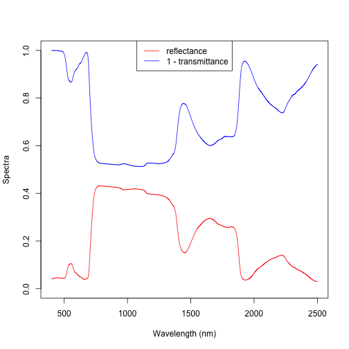

<!-- README.md is generated from README.Rmd. Please edit that file -->


# rrtm

<!-- badges: start -->
<!-- badges: end -->

The goal of `rrtm` is to provide efficient R implementations of radiative transfer models useful for vegetation remote sensing.

## Installation

`rrtm` is not currently on CRAN, but
you can install the development version of `rrtm` from [GitHub](https://github.com/) with:

``` r
# install.packages("devtools")
devtools::install_github("ashiklom/rrtm")
```

## Basic usage

This is a basic example of running the PROSPECT 5 leaf radiative transfer model.


```r
library(rrtm)
out <- prospect5(1.4, 40, 10, 0.01, 0.01)
plot(c(400, 2500), c(0, 1), type = "n",
     xlab = "Wavelength (nm)",
     ylab = "Spectra")
lines(400:2500, out$reflectance, col = "red")
lines(400:2500, 1 - out$transmittance, col = "blue")
legend("top", legend = c("reflectance", "1 - transmittance"),
       lty = 1, col = c("red", "blue"))
```



Here is a basic example of running the PRO4SAIL radiative transfer model (PROSPECT 5 coupled to the 4SAIL canopy model and Hapke soil model).


```r
sail_out <- pro4sail_5(N = 1.4, Cab = 40, Car = 10, Cbrown = 0,
                       Cw = 0.01, Cm = 0.01,
                       LAI = 3, soil_moisture = 0.5)
#> Error in pro4sail_5(N = 1.4, Cab = 40, Car = 10, Cbrown = 0, Cw = 0.01, : could not find function "pro4sail_5"

matplot(400:2500, do.call(cbind, sail_out),
        xlab = "Wavelength (nm)", ylab = "Reflectance (0-1)",
        type = "l", lty = "solid", col = 1:4)
#> Error in do.call(cbind, sail_out): object 'sail_out' not found
legend("topright", c("BHR", "DHR", "HDR", "BDR"),
       lty = "solid", col = 1:4)
#> Error in strwidth(legend, units = "user", cex = cex, font = text.font): plot.new has not been called yet
```
